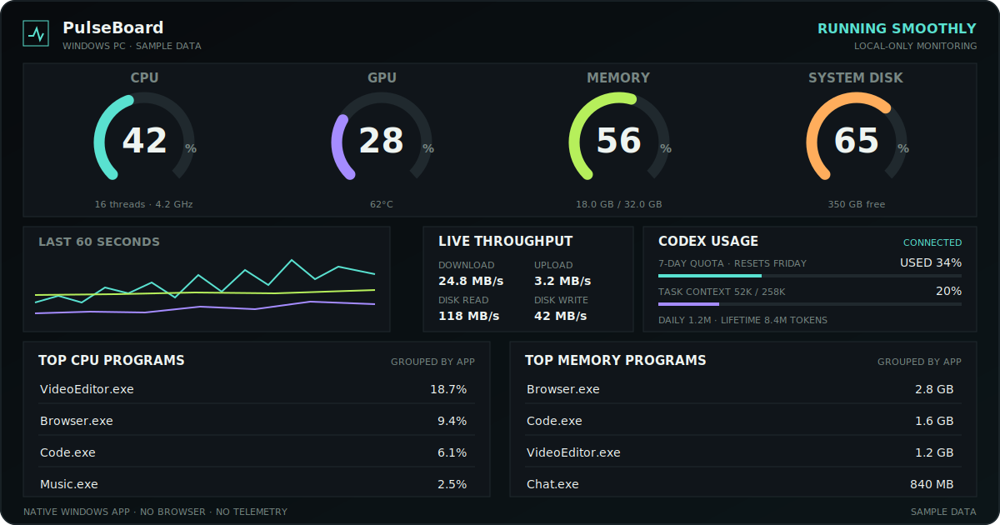

# PulseBoard

简体中文 · [English](README.md)

[](https://github.com/Justin-147/pulseboard/releases/latest)
[](https://github.com/Justin-147/pulseboard/releases)
[](https://github.com/Justin-147/pulseboard/actions/workflows/test.yml)
[](#运行要求)
[](LICENSE)

**紧凑、保护隐私的原生 Windows 系统与 Codex 用量仪表盘：CPU、GPU、内存、磁盘、网络和高占用程序，一页看全。**

[下载 Windows 版](https://github.com/Justin-147/pulseboard/releases/latest) · [报告问题](https://github.com/Justin-147/pulseboard/issues/new?template=bug_report.yml) · [功能建议](https://github.com/Justin-147/pulseboard/issues/new?template=feature_request.yml)



> 预览图使用示例数据。真实监控数据只在本机内存中处理，不会上传。

## 为什么使用 PulseBoard？

- **原生紧凑窗口：**不使用浏览器、不启动本地 Web 服务，一页展示，无需滚动。
- **信息有效：**四个实时表盘、最近 60 秒趋势、实时吞吐，以及 CPU/内存占用前五程序。
- **集成 Codex：**显示额度、重置时间、Token 汇总和当前任务上下文用量。
- **适合 Windows：**提供独立可执行文件、登录后自启动和单实例聚焦。
- **保护隐私：**没有遥测，不写入历史数据库，指标只在本机内存中处理。

## 快速开始

1. 下载并解压最新 [Windows Release](https://github.com/Justin-147/pulseboard/releases/latest)。
2. 双击 `PulseBoard.exe`。
3. 可选：双击 `Install-Autostart.bat`，以后登录 Windows 时自动弹出仪表盘。

Release 已包含独立运行程序，**不需要**安装浏览器或 Python。

## 开机自启动说明

PulseBoard **默认不会启用开机自启动**。仅运行 `PulseBoard.exe` 不会修改 Windows 启动设置。

- 需要登录 Windows 后自动弹出时，主动运行 `Install-Autostart.bat`。
- 不再需要自启动时，运行 `Uninstall-Autostart.bat`；该操作不会删除程序或其他文件。
- 自启动只对当前 Windows 用户生效，不需要管理员权限。

## 功能

| 区域 | 展示内容 |
| --- | --- |
| 系统资源 | CPU、GPU、内存、系统盘实时表盘 |
| 趋势 | 最近 60 秒 CPU、GPU、内存变化 |
| 实时吞吐 | 网络上下行、磁盘读写速度 |
| 程序排名 | CPU 和内存占用前五，按程序名合并 |
| NVIDIA GPU | 通过 `nvidia-smi` 显示利用率、显存和温度 |
| 其他 GPU | 尝试通过 Windows 性能计数器读取利用率 |
| Codex | 套餐额度、重置时间、日/累计 Token 和任务上下文 |
| 桌面体验 | 默认 920 × 640、支持缩放、可选自启动和单实例运行 |

## 运行要求

- Windows 10 或 Windows 11（Release 为 x64）。
- Codex Desktop/CLI 为可选项；Codex 数据不可用时，系统资源监控仍会继续运行。

## GPU 兼容性

PulseBoard 优先调用 NVIDIA 驱动自带的 `nvidia-smi`。AMD、Intel 及其他显卡会尝试读取 Windows GPU Engine 性能计数器；驱动未公开的温度或显存数据会显示为不可用，不使用估算值。

## Codex 数据说明

PulseBoard 会启动隐藏的本机 Codex app-server 进程，并只读访问 Codex Desktop 活动日志与本地 session 文件。它不会修改 Codex 数据，也不依赖旧的 `codex-usage-hud` 项目。

这些数据来自本机实现接口，而不是稳定的公开 API。Codex 后续升级后，PulseBoard 可能需要同步更新。

## 本地开发与测试

```powershell
python -m venv .venv
.\.venv\Scripts\python -m pip install -r requirements.txt
.\.venv\Scripts\python -m unittest discover -s tests -v
.\.venv\Scripts\python -m pulseboard.desktop
```

欢迎参与改进。提交 Pull Request 前请阅读 [CONTRIBUTING.md](CONTRIBUTING.md)。

## License

[MIT](LICENSE)
